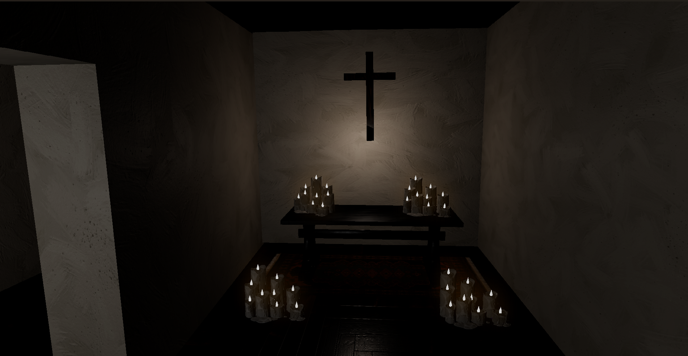
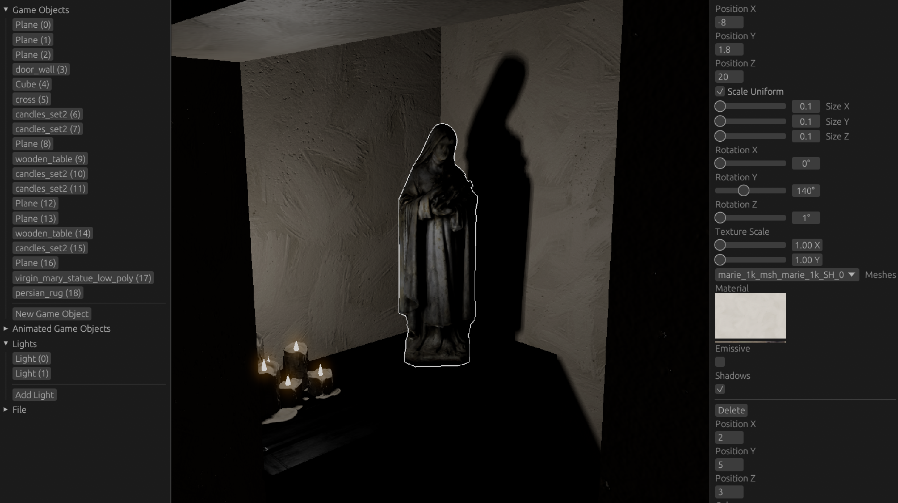

# YHWH Engine

Rust and WGPU based renderer

</>

</>

### Implemented features
- Dynamic scenes and level Editor
- Bloom
- Deferred renderer architecture
- SSAO
- Skeletal animation
- Inverted-hull outlining
- Custom mesh materials
- Physically based rendering
- Soft Shadows
- Skybox

### Controls
`WASD` movement 
`f1` Toggle editor 
`G` Interact 
`2` Hotload shaders 
