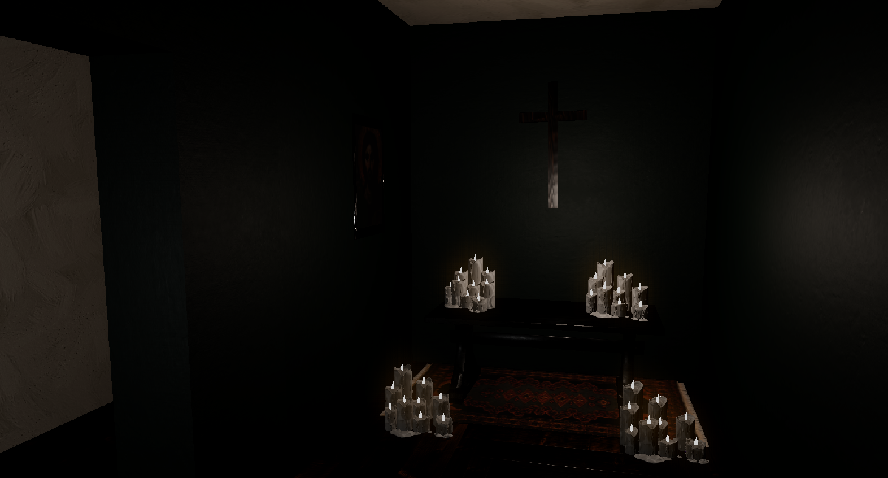

# YHWH Engine

Rust and WGPU based renderer

</>

</>

### Implemented features
- Dynamic scenes and level Editor
- MRT Bloom
- Skeletal animation
- Inverted-hull outlining
- Custom mesh materials
- Physically based rendering
- Soft Shadows
- Skybox
